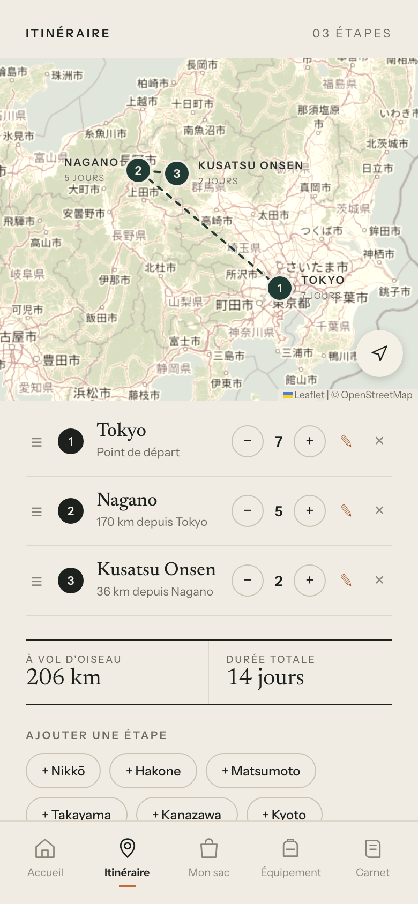

# Travel Field Manual

**Voyager léger. Aller loin.**

Un carnet de voyage de poche : vous préparez un sac qui pèse le juste nécessaire, vous dessinez votre itinéraire sur la carte, et vous notez ce que vous vivez en chemin. Tout tient dans votre téléphone, même sans réseau.

**[Ouvrir l'application](https://efrontin.github.io/travel-pack/)**

<p align="center">
  
</p>

## Ce que vous pouvez faire

- **Préparer votre sac.** Choisissez la destination, la durée et le sac, et l'application vous suggère de quoi remplir. Elle pèse le tout au fil de vos choix, pour savoir si vous restez sous la limite de poids de la cabine.
- **Cocher votre liste.** Une checklist avant le départ, pour ne rien oublier au fond du tiroir.
- **Comparer deux sacs.** Le 24 litres suffit-il, ou faut-il prendre le 30 ? La comparaison répond côte à côte.
- **Parcourir le catalogue d'équipement.** Sacs, technique, vêtements, photo, trousse et accessoires, avec le poids de chaque objet. Certains ont une fiche test : ce qu'on y aime, ce qu'on y aime moins, et un verdict.
- **Tracer votre itinéraire.** Ajoutez des étapes, réglez le nombre de jours de chacune, et suivez le parcours et les distances sur la carte. Changez l'ordre des étapes en les faisant glisser par la poignée (≡), ou avec les boutons ↑ / ↓ au clavier.
- **Tenir votre carnet.** Écrivez une fiche par étape et joignez-y vos photos.

## L'installer sur votre téléphone

L'application s'installe comme une vraie app, sans passer par un magasin.

**Sur iPhone** : ouvrez le lien dans Safari, touchez le bouton Partager, puis « Sur l'écran d'accueil ».

**Sur Android** : ouvrez le lien dans Chrome, puis choisissez « Installer l'application » dans le menu.

Une fois installée, elle fonctionne sans connexion. Les tuiles de la carte s'enregistrent au fil de vos visites, donc les zones déjà consultées restent visibles hors ligne.

## Vos données vous appartiennent

Il n'y a ni compte ni serveur. Tout ce que vous saisissez reste sur votre appareil.

Comme un téléphone peut être perdu, remplacé ou vidé, pensez à faire une **sauvegarde** de temps en temps : dans le menu, « Mes données » exporte un fichier JSON (photos comprises), que vous pouvez réimporter plus tard sur le même appareil ou un autre.

## Pour contribuer ou bricoler

Le projet est une application [Angular](https://angular.dev) (composants autonomes et signaux), avec [Leaflet](https://leafletjs.com) pour la carte et [Dexie](https://dexie.org) pour stocker les données dans IndexedDB.

```bash
npm install
npm start          # serveur de développement sur http://localhost:4200
npm test           # tests unitaires (Vitest)
npm run build      # build de production dans dist/
```

Le service worker n'est actif que dans le build de production. Pour l'essayer, servez le dossier `dist/travel-pack/browser`.

### Pour se repérer

- [`CONTEXT.md`](CONTEXT.md) explique le vocabulaire du projet (étape, lieu, itinéraire, note, fiche).
- [`docs/adr/`](docs/adr) garde la trace des décisions d'architecture, par exemple pourquoi les données sont dans IndexedDB.
- Les idées et les tâches vivent dans les [issues](https://github.com/efrontin/travel-pack/issues), suivies dans un projet GitHub.

Une idée, un bug, une question ? Ouvrez une issue : elle sera la bienvenue.
